## pipeline
1. There are two networks: one for generating the GT surface and one for generating training surface
2. The resolution of the training surface depends on the resolution of the GT surface, while the resolution of the GT surface is fixed with regard to input point cloud/sampled points.
3. The loss function is the difference between the GT surface and the training surface, which computes the difference between two point clouds. There are several alternatives for the loss function, such as L2 loss, Chamfer distance, etc.
4. Compute the gradient of the loss function with respect to the training surface and update the paramters like control points and kont vectors which gererates the training surface.

## preprocessing

With meshlab, I can do the following preprocessing:

1. open the mesh/.off file with meshlab. For instance, I can open the mesh 'horse.off' with meshlab.
 
    

2. click on the 'Filters' menu, then 'Sampling' and then 'Poisson-disk sampling'
   
3. set the 'Number of samples' to desired number of points and tick 'Exact number of samples' and then click 'Apply'
4. Now we can export the mesh as a .off file.
   
5. Extract the points from the .off file using python. Since the number of points are usually can't be a square number(don't know why). For instance, I want to get 2500 sample points from the original off object, but it may give me exact 2500 points or 2498 or 2510 points which may be close to 2500. So I always take sample which generates a bit more points than expected and then randomly select 2500 points from the sample. For instance, if I want 2500 points, I take 3000 points from the sample and then randomly select 2510 points from the sample. 

6. Find the maximum and minimum values of the points. Then normalize the points into the range [-1,1] using the maximum and minimum values. After normalization, x,y,z of the points are in the range [-1,1]. Now we are able to do the real training.

## results
Here are the results of reconstructing the xxx.off object with 2500 points. The first item in first row is the sample points(GT point cloud), the second item is the reconstructed surface while the third item is the recontructed surface with trained control points generated by trained parameters.

1. horse.off

     
2. luigi.off

    
3. sphere.off

    
4. hound.off

    
5. plane.off

    
6. cat.off

    

## evaluation

### evaluation 1 (Loss function on horse.off (control points = 150, evaluation points = 100, degree = 4))

| Loss function | epochs to finish | loss |
| --- | --- | --- |
| mse | 926 | 1e-6 |
| chamfer |  |  |
| chamfer + 0.1 * laplacian |  |  |
| chamfer + 0.1 * laplacian + 10 * hausdoff |  |  |
### evaluation 2 (timing on horse.off)

#### control points (evaluation points = 100, degree = 4)

| control points | timing(s) |
| --- | --- |
| 100 | 0.06940174815654755 |
| 150 | 0.07025064336700604 |
| 200 |0.07207150829648509 |
| 300 | 0.06809359949640728 |

#### evaluation points (conrol points = 150, degree = 4)

| evaluation points | timing(s) |
| --- | --- |
| 50 | 0.07836413537800119 |
| 100 | 0.07025064336700604 |
| 200 | 0.06989951157569885 |

#### degree (conrol points = 150, evaluation points = 100)

| degree | timing(s) |
| --- | --- |
| 3 | 0.07836413537800119 |
| 4 | 0.07025064336700604 |
| 5 |0.07207150829648509 |
